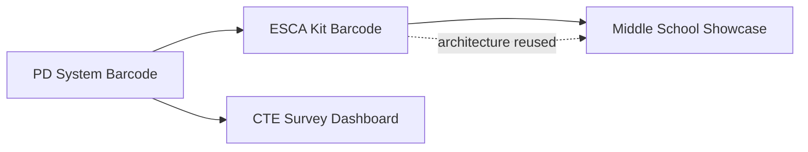

# CTE Internal Tools — Personal Portfolio

**Career & Technical Education · Dallas ISD** *(employer)*

> A collection of barcode, event, and analytics systems I designed and built while working at Dallas ISD CTE — each running entirely on Google Workspace with zero additional licensing cost, no external servers, and no SaaS subscriptions.

---

## About This Portfolio

I built these four internal tools while working at Dallas ISD Career & Technical Education, using Cursor AI as a development partner. Each project solved a real operational problem on my team — professional development check-in, kit inventory accountability, annual event coordination, and executive survey analysis.

These are **my projects**, developed in my role at the district. Dallas ISD is where they are deployed and used; I am the developer behind the design, code, and iteration.

The projects share a common design philosophy:

- **Google Sheets as the database** — auditable, editable by authorized staff, no new infrastructure
- **Google Apps Script as the application layer** — web apps, email, and business logic inside the district's existing Google Workspace
- **Barcode-driven workflows where physical operations matter** — scan, confirm, log
- **Admin portals that control content without code changes** — templates, site text, and configuration live in the sheet

This document is written as a personal case-study portfolio: what each system does, what was hard, what worked, what did not, and how my workflow improved from project to project.

**This is a living portfolio.** As I keep developing my skill set and growing in my role at Dallas ISD CTE, projects may be added, updated, or removed from this page. What you see here reflects where I am right now — not a fixed list.

---

## How the Projects Connect

| Project | Primary users | Core problem solved |
|---|---|---|
| [PD System Barcode](#1-pd-system-barcode-system) | PD staff, teachers at check-in stations | Manual attendance tracking across multi-day summer PD |
| [ESCA Kit Barcode](#2-esca-kit-barcode-system) | ESCA staff, campus counselors | No accountability for loaned career exploration kits |
| [CTE Survey Dashboard](#3-cte-survey-cross-reference-dashboard) | CTE executive leadership | Two years of survey data with no way to spot recurring unmet needs |
| [Middle School Showcase](#4-middle-school-showcase-hub) | Vendors, teachers, event coordinators | Annual showcase run through email chains and scattered spreadsheets |

---

## 1. PD System Barcode System

**What it does**

A barcode check-in system for Dallas ISD CTE professional development. Teachers scan printed barcodes at station URLs. Each scan records a status cycle — `IN → LUNCH OUT → LUNCH IN → OUT` — directly into a Google Sheet. Staff import teacher rosters, generate printable badges, configure lunch windows, and run end-of-day attendance email digests.

**Technology**

Google Apps Script · Google Sheets · HTML/CSS/JS scanner UI · `clasp` deployment · Node.js helper scripts for badge PDF generation and load testing

**Challenges**

- **Multi-day PD across eight session dates.** Summer PD ran across multiple Day 1 and Day 2 sessions on different calendar dates. The original `ScanLog` recorded every scan but had no way to label which session a scan belonged to. Filtering by day required manual date math.
- **Schema migration on a live sheet.** Adding `PD Day` and `Session` columns to an existing `ScanLog` with real data required an idempotent migration — not a wipe-and-rebuild.
- **Column insertion side effect.** Inserting new columns leaked the Station dropdown validation into the new columns. The values were correct; the dropdowns were wrong. This only surfaced after real scans were logged.
- **District email reality.** The first email-digest design assumed Gmail drafts. The district runs on Outlook. Apps Script cannot create Outlook drafts natively, so the workflow had to be redesigned around a mail-merge-friendly sheet export.
- **Concurrent scanning at scale.** Multiple stations scanning simultaneously required lock handling, staff caching, and load testing before district-wide rollout.

**What worked**

- A dedicated **`Sessions` sheet** mapping calendar dates to `PD Day` and `Session Label` — admins edit dates without touching code
- **Auto-stamping at scan time** — every new row gets its session from today's date lookup
- **Idempotent setup** — `Initialize / Repair System` safely migrates legacy layouts and re-applies validation rules
- **Station-specific URLs** — clearer reporting and simpler operator training
- **Local UI preview** — a browser mockup of the scanner interface before merging styles into production
- **Staff cache with warm trigger** — repeat scans stay fast under load
- **`Today's PD Emails` sheet** — personalized attendance receipts prepared for Outlook mail merge, with dedup tracking

**What did not work**

- **Gmail draft workflow** — technically correct inside Google, wrong for the district's Outlook environment
- **Assuming timestamp alone was enough** — executives and operators needed human-readable session labels, not just raw datetime filtering
- **Shipping column changes without re-running validation** — taught me to always pair structural migrations with explicit validation cleanup

**Key takeaway**

The PD System established the foundational pattern: barcode scan → Apps Script → Google Sheet. Every later project inherited some version of this architecture.

---

## 2. ESCA Kit Barcode System

**What it does**

Barcode-driven inventory, checkout, and return accountability for CTE career exploration kits loaned to campus counselors across all eight Director Regions. Counselors sign in with their Employee ID, scan a kit barcode to check out or return, confirm an item checklist, and receive automatic email confirmations. Administrators manage kits, generate labels, import campus data from CSV, send return reminders, and review a regional participation dashboard.

**Technology**

Google Apps Script · Google Sheets (13 tabs) · Vanilla HTML/CSS/JS · `clasp` · `MailApp` for automated email · TipWeb asset tags reused as kit barcodes

**Challenges**

- **Accountability at shared kiosks.** Before this system, counselors at shared kiosks had no individual checkout record. Manual spreadsheet entries and memory were the tracking method.
- **Scope creep during design.** Early plans included separate pages for scan, labels, kits, dashboard, and audit. That fragmented the counselor experience.
- **Bootstrapping a blank sheet remotely.** Initial deployment required creating all tabs and headers before the first `runSetup()` — solved with API bootstrap scripts alongside clasp push.
- **Consumable vs. durable items.** Some kit contents (batteries, handouts) needed different tracking rules than durable equipment.
- **Regional reporting for leadership.** Checkout data needed to roll up by Director Region, not just by campus.

**What worked**

- **Schema-driven `Data.gs`** — all tab names and column headers defined in one `SCHEMA` object; `ensureSchema()` adds columns without deleting data
- **Hub + Admin split** — public counselor interface and private admin portal served from the same deployment via `?view=` routing
- **Single Operations Hub** — one URL, scan auto-routes to checkout, check-in, or item update with no page reloads
- **Self-building counselor registry** — first EID sign-in creates the record; no pre-loading required
- **CSV import wizard** — bulk campus and counselor import with column mapping
- **Editable email templates** — checkout confirmation, return reminder, and overdue notice all editable in the Admin portal
- **TipWeb tag reuse** — one barcode number serves both asset management and ESCA checkout
- **Regional dashboard** — executive-ready participation view by Director Region

This system became the **gold standard** for my later projects. When I say "build it like ESCA," I mean: schema-first sheets, Hub/Admin routing, clasp deployment, and admin-editable content.

**What did not work**

- **Over-planning before the first deploy** — early designs had too many separate pages before I consolidated to one Operations Hub
- **"Perfect on first ship" mindset** — real counselor feedback changed the flow after MVP; iterating was faster than predicting every edge case upfront
- **Assuming TipWeb integration was MVP-critical** — I deferred deep integration and used TipWeb tags as barcodes instead, which was the right call

**Key takeaway**

ESCA codified the reusable architecture: `Code.gs` router, `Data.gs` schema, `Services.gs` business logic, `Hub.html` + `Admin.html`, clasp push, `runSetup()`. Middle School Showcase copied this layout directly.

---

## 3. CTE Survey Cross-Reference Dashboard

**What it does**

An interactive dashboard that cross-references the Dallas ISD CTE Annual Program Evaluation Survey across two academic years (2024–25 and 2025–26). It matches teachers by Employee ID, detects recurring open-ended needs, assigns priority scores (P1 Critical through P5 Resolved), groups results by region and campus, and presents an executive-ready view with campus heat maps, a priority queue, and resolution tracking.

**Technology**

Python (`openpyxl`) data pipeline · HTML/CSS/JS dashboard (Tailwind) · Google Apps Script web app hosting · `clasp` deployment · one-command `update_dashboard.py` rebuild and redeploy

**Challenges**

- **Two years of messy survey data.** Campus names were inconsistent between years (`HS` vs `High School`, abbreviations, punctuation). Matching required fuzzy normalization, not exact string equality.
- **No built-in region field.** Region had to be joined from an external campus mapping CSV — a step that did not exist in the original spreadsheets.
- **Open-ended text comparison.** Detecting "the same need repeated" across six question pairs required keyword overlap and similarity scoring, not just exact duplicate matching.
- **Apostrophes breaking the UI.** Campus names like `Irma Rangel Young Women's Leadership School` broke inline `onclick` handlers when passed as JavaScript string arguments. HTML entity escaping did not fix it because the browser decoded entities before JavaScript ran.
- **PII in version control.** Survey xlsx files and processed JSON contain teacher Employee IDs and responses. These must never be committed.
- **Deployment platform mismatch.** An early Netlify deployment path was abandoned in favor of Google Apps Script hosting to stay inside the district stack.

**What worked**

- **Employee ID as the join key** — reliable cross-year teacher matching across 457 unique teachers
- **P1–P5 priority scoring** — every teacher gets a score; campuses get a heat score rolled up from teacher priorities
- **Python → JSON → dashboard pipeline** — heavy data processing stays in Python; the browser gets a pre-computed `survey_data.js`
- **`update_dashboard.py` one-command deploy** — process data, bundle standalone HTML, clasp push, clasp deploy, same permanent URL every time
- **Campus drill-down by index** — passing numeric array indices instead of campus name strings eliminated the apostrophe bug permanently
- **Manual resolution tracking** — leadership can mark issues resolved; state persists to a Google Sheet via Apps Script
- **Strict `.gitignore`** — source code only in the repo; all PII-bearing files excluded

**What did not work**

- **Keyword cloud on the Executive Summary** — visually interesting but not executive-ready; removed in favor of cleaner priority distribution charts
- **Netlify as the host** — added a platform outside Google Workspace with no benefit for an internal district audience
- **HTML entity escaping for inline JS** — `&#39;` inside `onclick` attributes gets decoded by the HTML parser before JavaScript executes, so the apostrophe still breaks the string
- **Assuming campus names would match exactly** — required a dedicated normalization layer with abbreviation expansion (`HS` → `high school`, `MS` → `middle school`, etc.)

**Key takeaway**

Not every project is pure Apps Script. When the job is heavy data transformation across large spreadsheets, Python does the processing and GAS does the hosting. The lesson on string handling — pass IDs, not display names — applies everywhere.

---

## 4. Middle School Showcase Hub

**What it does**

A centralized web hub for the annual Middle School Showcase event. A public landing page links to a vendor portal and a teacher portal, each gated by ID number. A separate admin link (not published on the public site) controls event content, site appearance, vendor/teacher approvals, campus data, exhibitor and attendee registration, and email notifications.

**Technology**

Google Apps Script · Google Sheets · `Public.html` + `Admin.html` + shared styles · `clasp` · DEV/LIVE environment switch · Python helper for campus name updates

**Challenges**

- **Wrong first architecture.** The project started as React + Vite + Tailwind with a separate Netlify frontend talking to a GAS backend. For a district-internal tool with three operators, this added deployment complexity with no user-facing benefit.
- **Placeholder environment variables.** A `.env` file with a placeholder GAS URL disabled demo mode and caused `failed to fetch` errors before the backend was actually deployed.
- **Admin security model iteration.** An early password gate on the admin hub added friction. The final model: vendor and teacher portals stay ID-gated; admin access is controlled by who has the private link.
- **Campus data for registration emails.** Attendee registration needed principal email lookup from a campus CSV — patterned after ESCA's import workflow but with showcase-specific fields.
- **DEV vs LIVE data isolation.** Testing required a separate dev spreadsheet so test registrations never touched production event data.

**What worked**

- **Full pivot to GAS-only** — same model as ESCA: one Apps Script deployment serves all pages, `google.script.run` for all server calls, no external hosting
- **ESCA-style page split** — `Public.html` for vendors/teachers, `Admin.html` for staff, routed by `?page=` parameter
- **Site & Appearance admin tab** — hero title, intro text, portal card copy, and show/hide toggles editable without code changes
- **ID-gated portals** — vendors enter Vendor ID, teachers enter EID; both checked against sheet records with Active status
- **Campus CSV upload** — regional reporting and principal CC on registration emails, following the ESCA campus import pattern
- **DEV/LIVE switch** — `IS_LIVE` flag with auto-created dev spreadsheet for safe testing
- **Professional SVG icons** — replaced emoji icons with clean inline SVGs for a more polished public face

**What did not work**

- **React + Netlify for an internal GAS project** — two deployment surfaces, CORS considerations, and a frontend framework that district IT would not maintain
- **Single `Index.html` with all four views** — worked for prototyping but made admin and public concerns too tangled; splitting into separate HTML files was the right move
- **Admin password gate** — operators preferred link-based access control for a three-person team
- **Auto-CC office manager on emails** — simplified to principal-only CC after user feedback

**Key takeaway**

When a proven pattern exists (ESCA), start there. The React detour cost time but produced a clear rule: if the district stack is Google Workspace, build in Google Workspace from day one.

---

## What I Learned From My Mistakes

These lessons came directly from bugs, pivots, and production feedback across all four projects.

### 1. Plan the real-world constraints first

Before writing code, I now ask: What email system does the district use? How many days does the event run? Who edits content after launch? The PD email digest and Showcase admin security model both changed because I asked too late.

### 2. Ship an MVP, then iterate

ESCA's Operations Hub was not the first design — it was the third. Counselor feedback after the first deploy shaped the final flow. Perfecting the plan in isolation was slower than shipping something scan-able.

### 3. Schema-first sheets with safe migrations

Every project now uses a defined schema object and an idempotent setup function. Columns get added; data never gets deleted. The PD System column-migration bug proved that structural changes must always re-apply validation rules.

### 4. Do not fight the district stack

Google Apps Script + Google Sheets is not glamorous, but it requires zero new vendor approvals, zero server bills, and zero IT port requests. React + Netlify looked modern; GAS-only was deployable in minutes and maintainable by the people who already run the program.

### 5. Pass IDs, not display strings

Campus names with apostrophes, inconsistent capitalization, and abbreviations broke JavaScript handlers and join logic. Numeric indices and normalized keys are safer than human-readable labels in code paths.

### 6. Normalize district data before analysis

Survey campus names, kit campus imports, and showcase registration all needed fuzzy matching or CSV mapping layers. Raw district data is never clean on the first import.

### 7. Keep PII out of git

Survey spreadsheets, processed JSON with teacher responses, and staff rosters stay local or in Google Drive — never in a repository. The repo holds source code and deployment scripts only.

### 8. Demo mode must be explicit

An empty environment variable means demo mode. A placeholder URL means broken production mode. The Showcase `failed to fetch` bug was a one-character config mistake.

### 9. Admin controls content, not code

Email templates, session dates, site hero text, portal descriptions, and show/hide toggles all live in the sheet or admin portal. If an operator needs a developer to change copy, the design failed.

### 10. Ask clarifying questions before building

Every project started with questions about audience, constraints, and success criteria. The CTE Survey priority scale, PD multi-day sessions, and Showcase portal security all came from upfront clarification — not from guessing.

---

## How My Workflow Evolved

| Practice | PD System | ESCA Kit | Showcase | CTE Survey |
|---|---|---|---|---|
| **Architecture** | Monolithic GAS + scanner UI | Hub + Admin + schema layers | Copied ESCA layout | Python pipeline + GAS host |
| **Data store** | Single workbook, menu setup | 13-tab schema via `ensureSchema()` | Multi-tab with DEV/LIVE split | External xlsx + region CSV |
| **Deployment** | `clasp push` | `clasp` + redeploy scripts | `clasp` + dev/live scripts | `update_dashboard.py` one command |
| **UI approach** | Local scanner preview | Single Operations Hub URL | Public/Admin HTML split | Standalone bundled HTML |
| **User auth** | Station URLs + admin PIN | EID sign-in + allowlist | Portal ID + private admin link | No auth (leadership internal tool) |
| **Email** | Outlook mail-merge sheet | Auto-send via `MailApp` | Registration + principal CC | N/A |
| **Content editing** | Settings sheet | Admin email templates | Site & Appearance tab | Manual resolution tracking |
| **First deploy** | Menu-driven init | `runSetup()` + API bootstrap | `setupSheets()` | `process_surveys.py` |
| **Lessons applied forward** | Established barcode pattern | Became gold standard | Skipped React on pivot | Learned data normalization |

---

## Repository Links

Each project has its own git repository. Links below are placeholders — update with your GitHub URLs when repos are published.

| Project | Local path | GitHub |
|---|---|---|
| PD System Barcode | `Documents/Coding/PD System` | _add link_ |
| ESCA Kit Barcode | `Documents/Coding/ESCA` | _add link_ |
| CTE Survey Dashboard | `Documents/Coding/CTE Survey` | _add link_ |
| Middle School Showcase | `Documents/Coding/Middle Shcool Showcase` | _add link_ |

---

## Shared Technology Stack

| Layer | Technology | Why |
|---|---|---|
| Application runtime | Google Apps Script | Runs inside district Google Workspace — no new vendors |
| Database | Google Sheets | Auditable, exportable, editable by authorized staff |
| Frontend (GAS projects) | HTML · CSS · Vanilla JavaScript | No build step, no npm on deploy, works in any browser |
| Data processing | Python 3 + `openpyxl` | Heavy spreadsheet analysis where GAS would be too slow |
| Version control | Git + GitHub | Source code history and collaboration |
| Deployment CLI | `clasp` | Push local `.gs` and `.html` files to Apps Script projects |
| Barcode generation | JsBarcode + PDF scripts | Printable labels for kits and PD badges |
| Email | GAS `MailApp` + Outlook mail merge | Auto-send where possible; sheet export where district policy requires Outlook |

---

## Security and Data Notes

- These are **internal tools I built for Dallas ISD CTE**, not public open-source products
- Repositories contain **source code only** — no teacher PII, no survey responses, no staff rosters
- Live deployment URLs, spreadsheet IDs, and API tokens are stored locally and in Apps Script — not in git
- Web app access is configured per district IT policy (domain-restricted or specific user access)

---

## Built With

I designed and built every project in this portfolio while employed at Dallas ISD Career & Technical Education. Cursor AI served as a collaborative development partner — used for architecture planning, implementation, debugging, documentation, and iterative refinement across all four systems.

---

*Personal portfolio · Developer at Dallas ISD CTE · Last updated July 2026 · Subject to change as my role and skills evolve*
