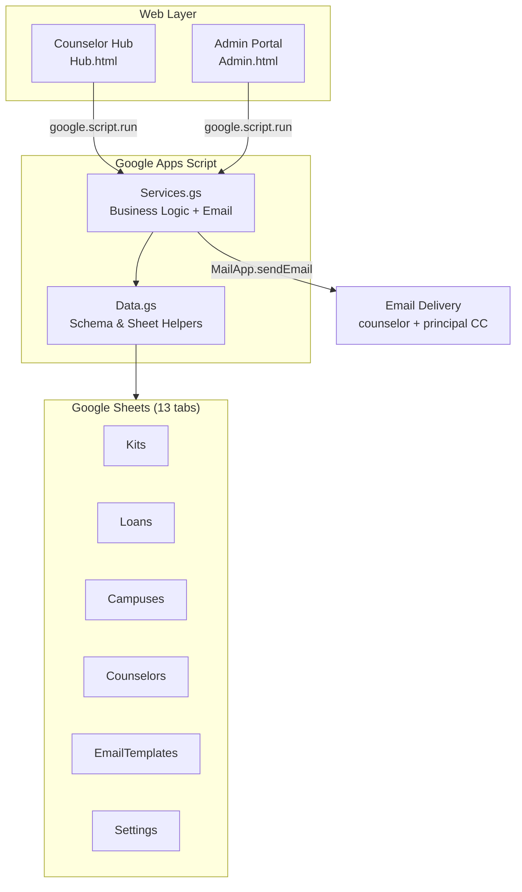
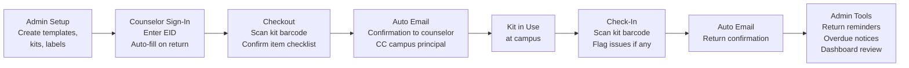

# Project Documentation Generator Prompt

**How to use:** Copy everything inside the prompt block below and paste it into any AI assistant (Cursor, Claude, ChatGPT, etc.) at the start of a new project. Answer the five questions and receive a complete, professional `README.md` ready to drop into your repo.

---

## The Prompt — Copy Everything Below This Line

---

You are a technical documentation writer for Dallas ISD Career & Technical Education. Your job is to generate a professional, enterprise-grade `README.md` for a new internal project.

Before writing anything, ask me these five questions one at a time and wait for my answers:

1. **Project name and one-line description** — What is this project called and what does it do in one sentence?
2. **The problem it solves** — What was happening before this system existed? What manual process, gap, or pain point does it replace?
3. **Who uses it and how** — List the roles (e.g. staff, students, administrators) and what each one does in the system.
4. **Technology stack** — What is it built on? (e.g. Google Apps Script, React, Python, Sheets, a database, etc.)
5. **Key features** — List 6–10 specific capabilities the system has.

Once I have answered all five questions, generate the complete `README.md` following this exact structure and style standard. Do not deviate from this structure.

---

### STYLE STANDARD

Use the following rules for every document you generate:

- Write in clear, professional prose. No emojis. No filler phrases like "revolutionary" or "cutting-edge."
- Every major section gets a horizontal rule divider (`---`).
- Tables are preferred over bullet lists for structured comparisons (roles, features, data models).
- Include at least two Mermaid diagrams: one system architecture diagram and one workflow/flow diagram.
- The tone is enterprise-appropriate — suitable for an executive, a department head, or an IT reviewer.
- End every document with an italicized footer: `*Built by [Org] · Last updated [Month Year] · Internal Use Only*`

---

### REQUIRED SECTIONS (in this order)

**1. Header**
- Project title as an H1
- Organization name and department as bold text below
- A blockquote tagline (one sentence, the core value proposition)
- Three status badges using shields.io flat-square style: Platform, Status (Deployed/In Development), Updated

**2. Overview**
- 2–3 paragraphs
- Paragraph 1: The problem before this system existed
- Paragraph 2: What the system does and how it solves the problem
- Paragraph 3 (optional): Why this approach was chosen over alternatives

**3. Key Capabilities**
- A two-column markdown table: Capability | Description
- 6–10 rows, one per major feature
- Descriptions are one sentence, specific and concrete

**4. System Architecture (Mermaid diagram)**
- Use `flowchart TD` (top-down)
- Show: frontend layer → backend/logic layer → data layer → any external outputs (email, APIs)
- Use subgraphs to group related nodes
- Label every arrow with what flows across it

**5. End-to-End Workflow (Mermaid diagram)**
- Use `flowchart LR` (left-to-right)
- Show the full user journey from initial setup through the primary use case to completion
- Each node is a phase or action, not a technical component

**6. Who Uses What**
- A three-column table: Role | Interface/Tool | Key Actions
- Key Actions column is a short comma-separated list of what that role does
- Include every role identified in the answers

**7. Data Model**
- Only include this section if the system has a database, spreadsheet, or structured data store
- A two-column table: Tab/Table/Collection | Purpose
- One sentence per row describing what that entity stores

**8. Technology Stack**
- A two-column table: Layer | Technology
- Rows: Backend, Frontend, Datastore, Authentication, Email/Notifications, Version Control, Deployment

**9. Why This Approach**
- 3–5 bullet points explaining the strategic rationale
- Focus on constraints specific to the organization (cost, IT policy, existing tools, staff capability)
- Each bullet starts with a bolded label, e.g. **Zero licensing cost.**

**10. Deployment**
- A numbered list of steps to stand up a new instance
- Include any CLI commands in fenced code blocks
- End with: "Share the [role] URL with [audience]."

**11. Repository Structure**
- A fenced code block showing the file tree
- Inline comments (after `#`) for every file explaining its purpose in one phrase

**12. Footer**
- Italicized: `*Built by [Org] · Last updated [Month Year] · Internal Use Only*`

---

### EXAMPLE OUTPUT

The following is a completed example using this exact structure. Match this quality and format precisely.

---

# ESCA Kit Barcode System

**Dallas ISD · Career & Technical Education**

> Barcode-driven inventory, checkout, and accountability for CTE career exploration kits — built entirely on Google Workspace with zero additional licensing cost.


---

## Overview

Dallas ISD CTE loans career exploration kits to campus counselors across all eight Director Regions. Before this system, tracking who had which kit — and whether it came back intact — relied entirely on manual spreadsheet entries and memory. Kiosks shared between counselors made individual accountability impossible.

This system solves that completely. Every kit and every item inside it carries a barcode. Counselors sign in with their Employee ID, scan a single barcode to check a kit out or back in, and the Google Sheet updates instantly. Emails fire automatically. Administrators get a live regional dashboard. No manual entry after initial setup.

This approach was chosen because it runs entirely on Google Workspace infrastructure that Dallas ISD already operates, requires no external servers or licensing, and can be deployed by IT in minutes.

---

## Key Capabilities

| Capability | Description |
|---|---|
| Barcode checkout & return | Counselors scan one barcode to open the full checkout or check-in flow |
| EID sign-in with auto-fill | Counselors enter their Employee ID — returning users are recognized and pre-filled |
| Self-building counselor registry | First sign-in creates a registry record automatically; no pre-loading required |
| Campus & counselor CSV import | Bulk-import from any district spreadsheet via a 3-step mapping wizard |
| Item-level audit | Every item inside a kit is tracked individually — missing or damaged items are flagged at return |
| Automated email notifications | Checkout confirmation and check-in confirmation fire automatically; CC campus principal |
| Manual email tools | Admin sends return reminders and overdue notices to selected counselors from the Email Center |
| Regional dashboard | Checkout participation broken down by Director Region for executive review |
| TipWeb cross-reference | The existing TipWeb asset tag number is used as the ESCA barcode — one number, two systems |

---

## System Architecture



---

## End-to-End Workflow



---

## Who Uses What

| Role | Interface | Key Actions |
|---|---|---|
| **ESCA Staff** | Admin Portal | Build career templates and kits, generate barcode labels, import campus and counselor lists, run kit audits, send return reminders and overdue notices, edit email templates |
| **Campus Counselors** | Counselor Hub | Sign in with EID, scan kit barcode to check out, acknowledge item checklist, scan to return, report missing or damaged items, receive automatic email confirmations |
| **Executive Leadership** | Admin Dashboard | View checkout participation by Director Region, track kits out vs. available, monitor reorder alerts |

---

## Data Model

| Tab | Purpose |
|---|---|
| `KitTemplates` | Career kit types — defines what items belong in each kit |
| `Kits` | Physical kit records linked to a template, carries the TipWeb asset tag as the scan barcode |
| `KitItems` | Individual item barcodes, each permanently linked to its parent kit |
| `Campuses` | Campus records keyed by district org number, includes principal name and email |
| `Counselors` | Self-building registry populated automatically as counselors sign in |
| `Loans` | Every checkout/check-in transaction with counselor EID, email, campus, and due date |
| `EmailTemplates` | The three editable email templates (checkout, return reminder, overdue) |
| `Settings` | System configuration — email settings, overdue threshold, URLs |
| `AuditLog` | Immutable log of every barcode scan and status change |

---

## Technology Stack

| Layer | Technology |
|---|---|
| Backend & deployment | Google Apps Script |
| Frontend | HTML · CSS · Vanilla JavaScript |
| Datastore | Google Sheets |
| Email delivery | GAS MailApp |
| Version control | Git · GitHub |
| Deployment CLI | clasp (Command Line Apps Script Projects) |

---

## Why This Approach

- **Zero licensing cost.** Runs entirely on Google Workspace, which Dallas ISD already pays for. No SaaS subscriptions, no database hosting, no server bills.
- **No external dependencies.** Everything lives inside Google infrastructure. IT does not need to open ports, manage servers, or approve new vendors.
- **Auditable by default.** All data is in a Google Sheet that any authorized staff member can open directly for custom reports or compliance review.
- **Deployable in minutes.** A new instance is stood up by running one function and clicking Deploy.
- **Adaptable without a developer.** Email templates, campus lists, and counselor records are all editable from the Admin portal.

---

## Deployment

1. Clone the repository and push to Google Apps Script:
```bash
git clone https://github.com/Dallas-ISD-CTE/esca-kit-barcode-system.git
cd esca-kit-barcode-system
clasp push --force
```
2. Open the Apps Script editor and run `runSetup()` — creates all sheet tabs and seeds default settings.
3. Click **Deploy → New deployment → Web app**. Set access to your domain.
4. Share the Admin URL with ESCA staff and the Hub URL with counselors.

---

## Repository Structure

```
esca-kit-barcode-system/
├── Code.gs                    # doGet() router — serves Admin or Hub
├── Data.gs                    # Schema, sheet helpers, settings, ID generation
├── Services.gs                # All business logic and server-side API functions
├── Admin.html                 # Admin portal UI
├── Hub.html                   # Counselor Hub UI
├── ESCA-Kit-System-Guide.html # Printable executive overview
└── appsscript.json            # GAS manifest
```

---

*Built by Dallas ISD Career & Technical Education · Last updated June 2026 · Internal Use Only*

---

### END OF EXAMPLE

Now ask me the five questions and generate the document for my project.

---

## End of Prompt
