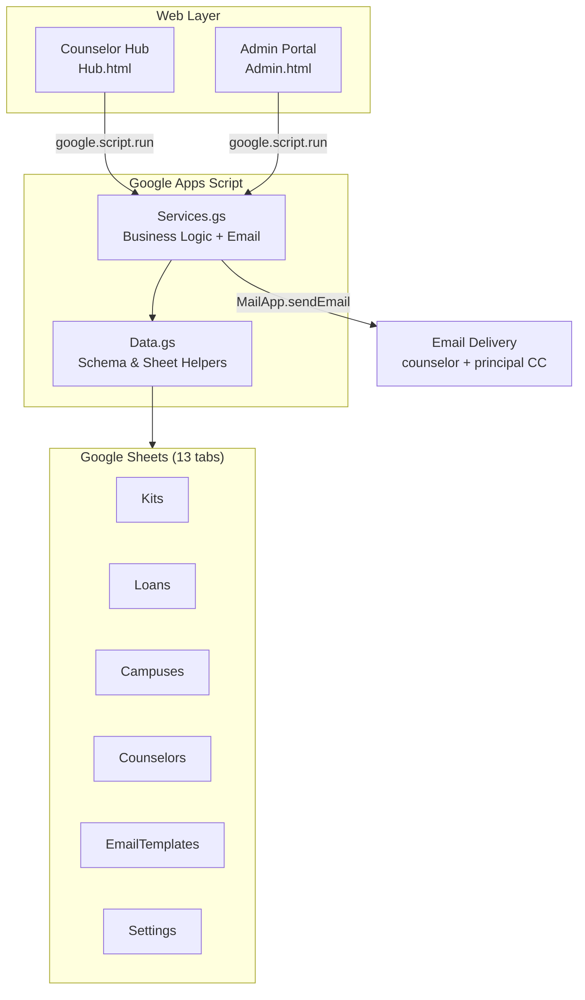
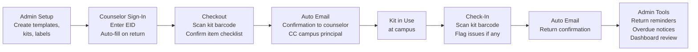
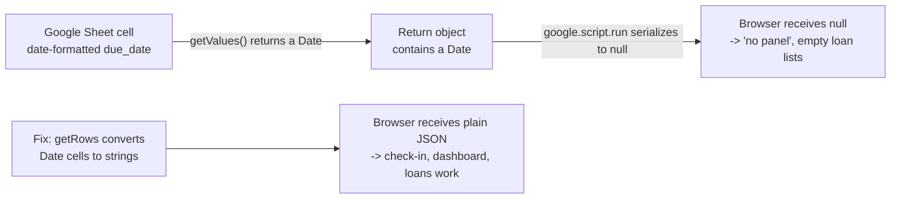

# ESCA Kit Barcode System

**Dallas ISD · Career & Technical Education**

> Barcode-driven inventory, checkout, and accountability for CTE career exploration kits — built entirely on Google Workspace with zero additional licensing cost.

> **React rebuild fork:** This repo preserves the original Google Apps Script app (`Hub.html`, `Admin.html`, `Code.gs`, `Services.gs`, `Data.gs`) and adds a React + Vite client (`client/`) plus a Node/Express API (`server/`) that talks to the same Google Sheets. Build the React app into a single HTML file with `npm run build:gas` in `client/` (writes `ReactApp.html`), then open it via `?view=react` / `?view=react-admin`.


---

## Overview

Dallas ISD CTE loans career exploration kits to campus counselors across all eight Director Regions. Before this system, tracking who had which kit — and whether it came back intact — relied entirely on manual spreadsheet entries and memory. Kiosks shared between counselors made individual accountability impossible.

This system solves that completely. Every kit and every item inside it carries a barcode. Counselors sign in with their Employee ID, scan a single barcode to check a kit out or back in, and the Google Sheet updates instantly. Emails fire automatically. Administrators get a live regional dashboard. No manual entry after initial setup.

---

## Key Capabilities

| Capability | Description |
|---|---|
| Barcode checkout & return | Counselors scan one barcode to open the full checkout or check-in flow |
| EID sign-in with auto-fill | Counselors enter their Employee ID — returning users are recognized and pre-filled |
| Self-building counselor registry | First sign-in creates a registry record automatically; no pre-loading required |
| Campus & counselor CSV import | Bulk-import from any district spreadsheet via a 3-step mapping wizard |
| Item-level audit | Every item inside a kit is tracked individually — missing or damaged items are flagged at return |
| Automated email notifications | Checkout confirmation and check-in confirmation fire automatically; CC campus principal |
| Manual email tools | Admin sends return reminders and overdue notices to selected counselors from the Email Center |
| Regional dashboard | Checkout participation broken down by Director Region for executive review |
| TipWeb cross-reference | The existing TipWeb asset tag number is used as the ESCA barcode — one number, two systems |
| Editable email templates | All three email templates are editable in the Admin portal — no code changes needed |

---

## System Architecture



Both web apps are served by the same Google Apps Script deployment. There is no external server, database, or paid service.

---

## End-to-End Workflow



---

## Who Uses What

| Role | Interface | Key Actions |
|---|---|---|
| **ESCA Staff** | Admin Portal | Build career templates and kits · Generate barcode labels · Import campus and counselor lists from CSV · Run kit audits · Send return reminders and overdue notices · Edit email templates · View regional dashboard |
| **Campus Counselors** | Counselor Hub | Sign in with EID · Scan kit barcode to check out · Acknowledge item checklist · Scan to return · Report missing or damaged items · Receive automatic email confirmations |
| **Executive Leadership** | Admin Dashboard | View checkout participation by Director Region · Track kits out vs. available · Monitor reorder alerts |

---

## Data Model

All data lives in a single Google Sheet with 13 tabs. The schema is defined in `Data.gs` and managed by `ensureSchema()` — safe to re-run at any time without deleting existing data.

| Tab | Purpose |
|---|---|
| `KitTemplates` | Career kit types — defines what items belong in each kit |
| `TemplateItems` | Line items per template with quantities and reorder thresholds |
| `Kits` | Physical kit records — linked to a template, carries the TipWeb asset tag as the scan barcode |
| `KitItems` | Individual item barcodes — each permanently linked to its parent kit |
| `ItemTypes` | Item definitions (stethoscope, cable, etc.) with reorder thresholds |
| `Campuses` | Campus records — keyed by district org number, includes principal name and email |
| `Counselors` | Self-building registry — populated automatically as counselors sign in |
| `Loans` | Every checkout/check-in transaction with counselor EID, email, campus, and due date |
| `CheckoutItems` | Item checklist snapshot at each checkout |
| `CheckinIssues` | Damage and missing item reports logged at return |
| `EmailTemplates` | The three editable email templates (checkout, return reminder, overdue) |
| `Settings` | System configuration — email settings, overdue threshold, URLs, barcode prefix |
| `AuditLog` | Immutable log of every barcode scan and status change |

---

## Technology Stack

| Layer | Technology |
|---|---|
| Backend & deployment | Google Apps Script (JavaScript runtime) |
| Frontend | React 19 · Vite · TypeScript · Tailwind (bundled to a single HTML file for GAS) |
| Data fetching | TanStack Query over a dual transport (`google.script.run` in GAS, `fetch` in dev) |
| Local dev mirror | Node · Express API against the same Google Sheets |
| Datastore | Google Sheets |
| Email delivery | GAS `MailApp` |
| Version control | Git · GitHub |
| Deployment CLI | `clasp` (Command Line Apps Script Projects) |

---

## Recent Work & Engineering Challenges

The July 2026 iteration moved the app from the original vanilla-JS Apps Script UI to a React + Vite front end (bundled into a single `ReactApp.html` for GAS) while keeping the same Google Sheets backend. Several real production issues surfaced during the demo rollout and were root-caused and fixed:

| Area | Challenge | Resolution |
|---|---|---|
| Check-in silently failed | Scanning a checked-out kit "did nothing" and the counselor's open loans looked empty | Root cause: `google.script.run` delivers `null` to the browser for any return payload containing a `Date` object (a date-formatted `due_date` cell). Fixed at the source in `getRows` by normalizing `Date` cell values to `MM/DD/YYYY` strings so every response serializes cleanly. |
| Same class of bug | Admin dashboard occasionally rendered blank | The dashboard payload also carried loan `Date`s and returned `null`; the `getRows` fix resolved it, backed by a React `ErrorBoundary` so one bad page can never white-screen the whole Admin shell. |
| Semester due dates | Overdue was "N days after checkout," but kits are loaned per semester with a fixed calendar return date | Replaced `overdue_threshold_days` with an admin-set `default_due_date`; changing it updates every open loan, and overdue math now compares against the calendar date. |
| Scanner race condition | A fast barcode scanner (types + Enter in one tick) could submit an empty value and silently reset | The scan submit now reads the input's DOM value at submit time (not lagging React state) and surfaces empty submits instead of no-oping. |
| Reliable check-in | Scanning is fragile on kiosk hardware | Added a scan-independent "Check in" button on the counselor's "currently have out" list; the open loan is treated as the source of truth and the scan matches either the kit sticker or the TipWeb tag. |
| Removing kits & templates | No way to delete a physical kit or an unlabeled/junk career template | Added guarded delete: a kit checked out cannot be removed; deleting a template unlinks (never deletes) the kits using it and hard-removes blank/junk template rows. |
| Dual-transport routing | A `DELETE /kits/...` call reported "No GAS mapping" | Hardened the client's REST-to-`google.script.run` mapper: path normalization plus explicit top-level DELETE routes. |
| Data read correctness | `getRows` row-range was off by one | Corrected the read range so the newest sheet row is always included and no phantom trailing row is produced. |



---

## Why This Is the Standard

This system was designed specifically for a school district environment:

- **Zero licensing cost.** Runs entirely on Google Workspace, which Dallas ISD already pays for. No SaaS subscriptions, no database hosting, no server bills.
- **No external dependencies.** Everything — the web app, the data, the email sender — lives inside Google's infrastructure. IT does not need to open ports, manage servers, or approve new vendors.
- **Auditable by default.** All data is in a Google Sheet that any authorized staff member can open directly for custom reports, exports, or compliance review.
- **Deployable in minutes.** A new instance can be stood up by running one function and clicking Deploy. No infrastructure provisioning required.
- **Adaptable without a developer.** Email templates, campus lists, and counselor records are all editable from the Admin portal. The system grows with the program.

---

## Deployment

```bash
# 1. Clone the repository
git clone https://github.com/Dallas-ISD-CTE/esca-kit-barcode-system.git

# 2. Push to Google Apps Script
cd esca-kit-barcode-system
clasp push --force
```

3. Open the [Apps Script editor](https://script.google.com), find the project, and run `runSetup()` — this creates all sheet tabs, seeds default settings, and loads the email templates.
4. Click **Deploy → New deployment → Web app**. Set access to your domain.
5. Share the Admin URL with ESCA staff and the Hub URL with counselors.

---

## Repository Structure

```
esca-kit-barcode-system/
├── Code.gs                    # doGet() router — serves Admin or Hub based on ?view param
├── Data.gs                    # Schema definitions, sheet helpers, settings, ID generation
├── Services.gs                # All business logic and server-side API functions
├── Admin.html                 # Admin portal UI
├── Hub.html                   # Counselor Hub UI
├── ESCA-Kit-System-Guide.html # Printable executive overview (also served as /guide)
├── appsscript.json            # GAS manifest
└── .clasp.json                # clasp project config
```

---

*Built by Dallas ISD Career & Technical Education · Last updated June 2026 · Internal Use Only*
